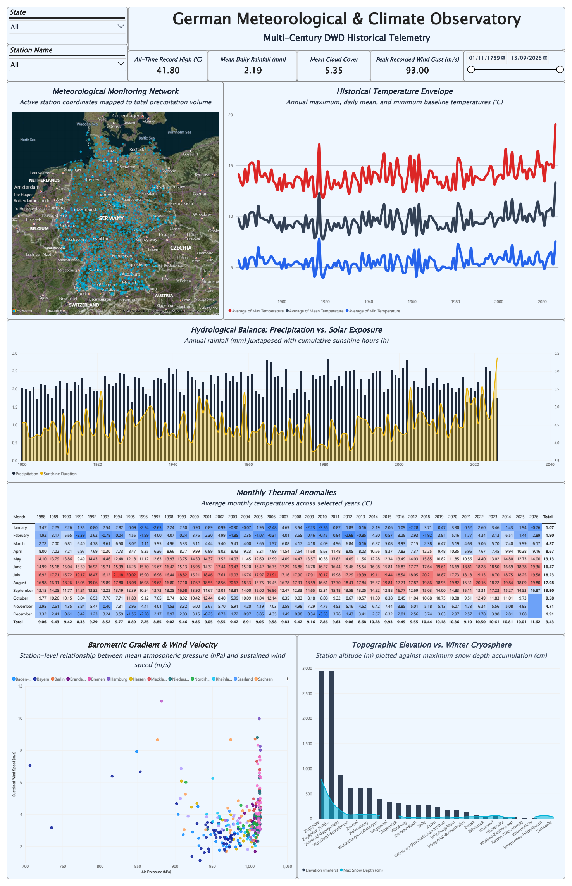
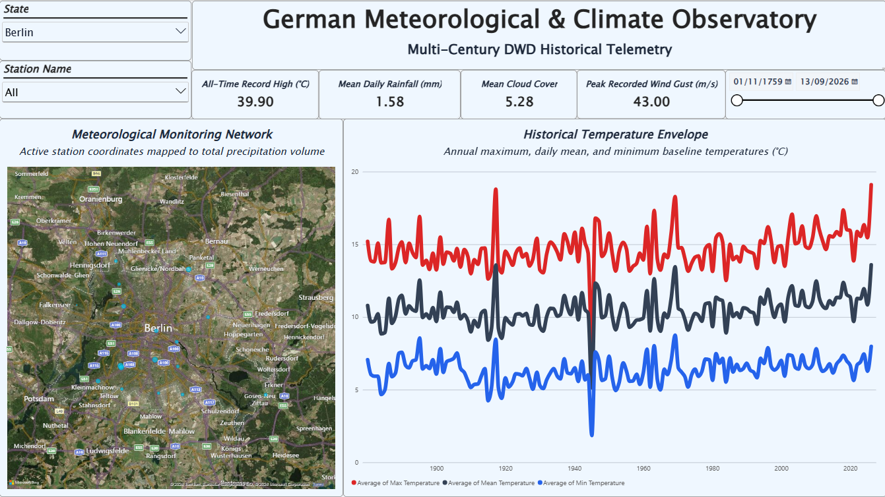
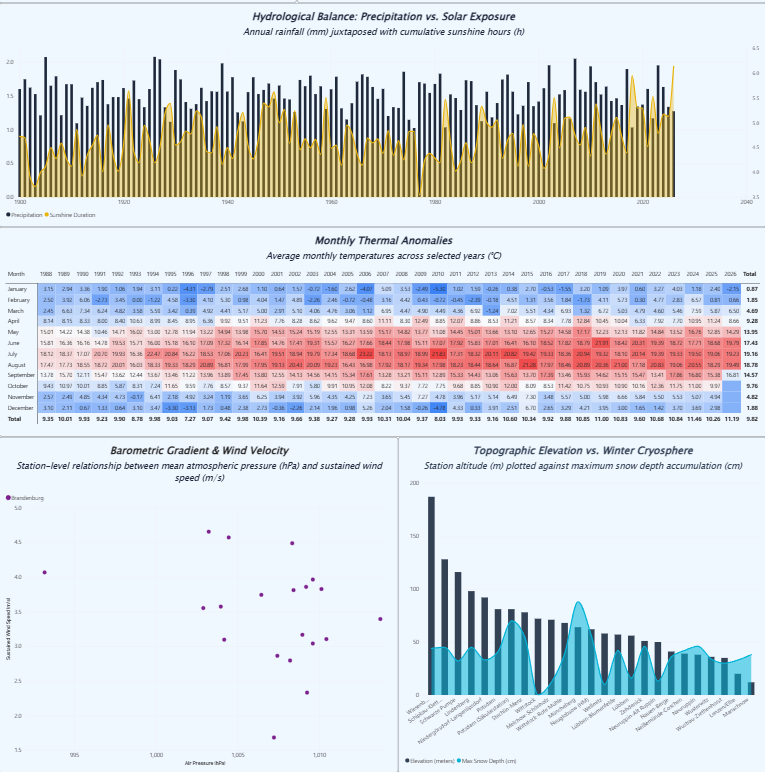
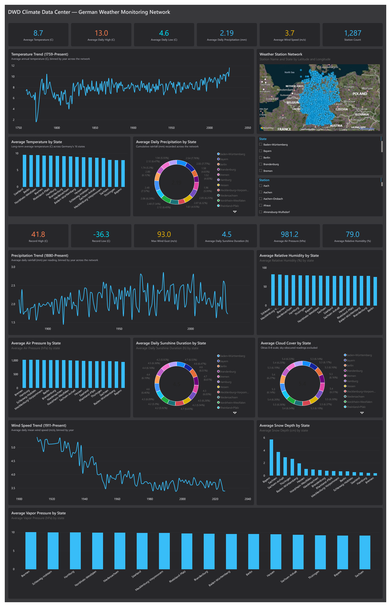

# DWD Klimadaten Deutschland

Dieses Projekt holt Jahrzehnte an Wetterdaten vom **DWD** (Deutscher
Wetterdienst) aus dem **Climate Data Center (CDC)**, seinem offenen
Datenserver. Ein Python-Skript lädt tausende Dateien herunter, macht sie
sauber und speichert sie als Parquet-Dateien. Aus diesen Daten ist ein
Power-BI-Report entstanden: eine Seite im Format **1920x1080**, mit
Jahrzehnten an Temperatur-, Niederschlags-, Wind- und Bodendaten für ganz
Deutschland.

## Vorschau

Der Report zeigt eine Deutschlandkarte mit allen Wetterstationen, den
Temperaturverlauf seit den Anfängen der Messung, Niederschlag und
Sonnenschein pro Jahr, eine Tabelle mit den Monatswerten, und zwei weitere
Diagramme zu Wind/Luftdruck und Schneehöhe.



Gefiltert auf das **Bundesland Berlin**:



Ausschnitt der unteren Hälfte, gefiltert auf **Brandenburg**:



## Layout

```
DWD-Climate-Data-Center/
  config.py               # Netzwerke (kl, more_precip, ...), Pfade, Konstanten
  dwd_engine.py            # Motor: list_dir / mirror_network / build_network
  fetch_dwd_climate.py     # CLI-Einstieg - das Skript, das man aufruft
  run_daily.bat            # taeglicher Lauf ueber Windows Task Scheduler
  requirements.txt
  API_ACCESS.txt           # genaue Anleitung: wie man an die Rohdaten kommt, git-ignoriert
  dwt-weather-data.pbix    # der fertige Power-BI-Report (liegt in Git LFS, siehe unten)
  dwt-weather-data.pbip              # Power-BI-Projekt (textbasiert), Claude-Version - siehe Vergleich unten
  dwt-weather-data.Report/            # PBIR: Seiten, Diagramme als JSON
  dwt-weather-data.SemanticModel/     # TMDL: Tabellen, Beziehungen, DAX-Kennzahlen
  docs/                     # Screenshots fuer dieses README
  .gitignore
  .gitattributes            # sagt Git, dass *.pbix ueber Git LFS laeuft
  raw/                      # unveraenderte Downloads (zips), git-ignoriert
    kl/
      KL_Tageswerte_Beschreibung_Stationen.txt
      historical/*.zip
      recent/*.zip
    more_precip/  soil_temperature/  water_equiv/   (gleiche Struktur)
  data/                      # Ergebnis: data/<netzwerk>.parquet, git-ignoriert
  logs/                      # daily.log vom Task Scheduler
```

## Wie der Prozess laeuft

`python fetch_dwd_climate.py` macht fuer jedes Netzwerk (`kl`, `more_precip`,
`soil_temperature`, `water_equiv`) zwei Schritte nacheinander:

**Schritt 1 - herunterladen (`mirror_network` in dwd_engine.py).**
Das Skript liest die Verzeichnis-Seite jedes Netzwerks auf dem DWD-Server,
findet die Stationsliste und jede Zip-Datei in `historical/` und `recent/`,
und laedt sie nach `raw/<netzwerk>/` herunter. `historical/`-Dateien aendern
sich nie (ein Jahr ist abgeschlossen), daher werden bereits vorhandene
Dateien uebersprungen. `recent/`-Dateien sind ein rollierendes Fenster von
ca. 500 Tagen und werden **jedes Mal neu heruntergeladen**, damit der
heutige Messwert ankommt.

**Schritt 2 - aufbereiten (`build_network` in dwd_engine.py).**
Das Skript oeffnet jede Zip-Datei aus `raw/`, liest nur die
`produkt_*`-Datei darin (Semikolon-getrennt, Latin-1, `-999` = fehlender
Wert), haengt alle Stationen zu einer grossen Tabelle zusammen, und
ergaenzt Stationsname, Bundesland, geographische Breite/Laenge und
Hoehe aus der Stationsliste. Ueberlappt sich `recent/` mit `historical/`
(am Jahreswechsel), gewinnt der aktuellere Wert. Ergebnis:
`data/<netzwerk>.parquet`.

Beim allerersten Lauf dauert Schritt 1 lange - fuer `kl` allein sind das
ueber 1.200 Stationen mit bis zu 140 Jahren Tagesdaten, mehrere GB, gut eine
Stunde. Jeder Lauf danach ist schnell (wenige Minuten), weil nur `recent/`
plus eventuell neu veroeffentlichte `historical/`-Dateien geladen werden -
darum ist `run_daily.bat` fuer den taeglichen Task Scheduler gedacht.

```
python fetch_dwd_climate.py                  # mirror + build, alle 4 Netzwerke
python fetch_dwd_climate.py --networks kl    # nur allgemeines Klima (am kleinsten)
python fetch_dwd_climate.py mirror           # nur herunterladen
python fetch_dwd_climate.py build            # nur neu aufbereiten, kein Netzwerkzugriff
```

## Installieren und starten

```bash
pip install -r requirements.txt
python fetch_dwd_climate.py
```

## Jeden Tag automatisch laufen lassen

Unter Windows macht das die **Aufgabenplanung** (Task Scheduler). In diesem
Repo liegt dazu `run_daily.bat`. Diese Datei wechselt in den Projekt-Ordner,
startet das Skript und schreibt die Ausgabe nach `logs/daily.log`.

Die Aufgabe wird so angelegt (PowerShell):

```powershell
$dir = "C:\Users\<name>\...\DWD-Climate-Data-Center"
$action  = New-ScheduledTaskAction -Execute "$dir\run_daily.bat" -WorkingDirectory $dir
$trigger = New-ScheduledTaskTrigger -Daily -At 7:00AM
$settings = New-ScheduledTaskSettingsSet -StartWhenAvailable -ExecutionTimeLimit (New-TimeSpan -Hours 4)
Register-ScheduledTask -TaskName "DWD-Climate-daily" -Action $action -Trigger $trigger -Settings $settings
```

## Die Daten

| Datei | Netzwerk | Was drin ist |
| --- | --- | --- |
| `data/kl.parquet` | `kl` | Tagesmittel-/min-/max-Temperatur, Niederschlag, Sonnenscheindauer, Wind, Luftdruck, Luftfeuchte - ~1.200 Stationen |
| `data/more_precip.parquet` | `more_precip` | Nur Niederschlag, aber deutlich mehr Stationen (~5.500) |
| `data/soil_temperature.parquet` | `soil_temperature` | Bodentemperatur in 5/10/20/50/100 cm Tiefe |
| `data/water_equiv.parquet` | `water_equiv` | Schneehöhe und Wasseräquivalent des Schnees |

Alle vier teilen dieselben Spalten `station_id`, `date`, `station_name`,
`state`, `lat`, `lon`, `elevation_m` - in Power BI per `station_id` und
`date` zu einem Sternschema verknuepfbar. Die Parquet-Dateien selbst
liegen **nicht** im Repo (zusammen fast 700 MB, siehe `.gitignore`) - sie
entstehen einfach neu, wenn man `fetch_dwd_climate.py` laufen laesst.

**Zugriff auf die Rohdaten:** siehe `API_ACCESS.txt` - kein API-Key, kein
Konto, Lizenz DL-DE->Zero-2.0 (quasi public domain).

## Der Power-BI-Report

Die Datei `dwt-weather-data.pbix` ist eine Seite (1920x1080) mit:

- **Karte** – alle Wetterstationen, Punktgroesse nach gesamtem Niederschlag.
- **Temperaturverlauf** – jaehrliche Maximum-, Mittel- und
  Minimum-Temperatur ueber den ganzen Messzeitraum.
- **Niederschlag vs. Sonnenschein** – Balken fuer den Jahresniederschlag,
  Flaeche fuer die Sonnenstunden, pro Jahr.
- **Monatstabelle** – Durchschnittstemperatur je Monat und Jahr, farblich
  markiert (Heatmap).
- **Wind vs. Luftdruck** – Streudiagramm je Station.
- **Hoehe vs. Schneehoehe** – Stationshoehe im Vergleich zur maximalen
  Schneehoehe.

Oben links kann man nach **Bundesland** und **Station** filtern, oben
rechts nach Zeitraum.

Die `.pbix`-Datei ist knapp **200 MB** gross - zu gross fuer eine normale
Git-Datei bei GitHub (Limit: 100 MB). Sie liegt deshalb in **Git LFS**
("Large File Storage"). Zum Klonen mit der vollen `.pbix`-Datei wird
`git-lfs` gebraucht:

```bash
git lfs install
git clone https://github.com/vulevu228/DWD-Climate-Data-Center.git
```

Ohne Git LFS bekommt man beim Klonen nur einen kleinen Platzhalter statt der
echten `.pbix`-Datei.

## Vergleich: Mensch-Report vs. Claude-Report

Der Report oben (`dwt-weather-data.pbix`) wurde von Hand in Power BI gebaut.
Als Experiment habe ich Claude gebeten, denselben Datensatz komplett neu als
Power-BI-Projekt (`.pbip` - textbasiert statt Binärdatei, direkt aus Git
lesbar) zu gestalten, ohne die alten Diagramme zu kopieren. Das Ergebnis
liegt als `dwt-weather-data.pbip` + `dwt-weather-data.Report/` +
`dwt-weather-data.SemanticModel/` in diesem Repo, direkt neben der `.pbix`.

|  | Mein Report (`.pbix`) | Claude-Report (`.pbip`) |
| --- | --- | --- |
| Seitengröße | 1920x1080 | 1920x3000 (mehr Platz, mehr Diagramme) |
| Hintergrund | Hellgrau/Weiß | Dunkles Neutralgrau (`#18181B` / `#27272A`) |
| Akzentfarben | Ein Petrol-Ton für fast alles | Vier Farben nach Bedeutung: Blau (Standard), Orange (Maximum), Cyan (Minimum), Gelb (Hervorhebung) |
| Schrift | Constantia, oft kursiv | Segoe UI durchgehend, keine Kursivschrift |
| Aggregation | Teilweise Summe auf Temperatur/Druck/Wind (Power-BI-Standard) | Jede Kennzahl explizit als Durchschnitt/Maximum/Minimum benannt - keine Summen-Fallen bei nicht-additiven Größen |
| Diagramme | 14, teils überlappend | 27, exakt im Raster (8-10px Abstand), keine Überlappung |
| Diagrammtypen | Karte, Zeitreihe, Kombi-Diagramm (Balken+Fläche), Heatmap-Tabelle, Streudiagramm | Karte, Zeitreihe, Balken, Donut, Kennzahlen-Karten, Auswahllisten |

**Ehrliches Fazit:** Der Claude-Report ist auf einen Blick leichter zu lesen
und zu überwachen - konsistente Farben nach Bedeutung statt nach Geschmack,
gleich formatierte Titel/Untertitel auf jedem Diagramm, und ein sauberes
Raster ohne Überlappung. Dafür fehlen ihm zwei Diagrammtypen, die mein
Report hat: die Heatmap-Tabelle und das Streudiagramm. Die wurden bewusst
weggelassen, nachdem eine Tabelle beim ersten Versuch den ganzen Report am
Laden gehindert hat - Claude hat den Fehler gefunden (fehlerhafte
Datenbindung), aber statt es erneut zu riskieren, auf robustere
Diagrammtypen umgestellt.

<table>
<tr>
<th>Mein Report</th>
<th>Claude-Report</th>
</tr>
<tr>
<td></td>
<td></td>
</tr>
</table>

## Grenzen der Daten

- **Rohdaten sind roh.** Der DWD prueft seine Messwerte zwar, aber einzelne
  Stationen koennen trotzdem Luecken oder Ausreisser haben - das Skript
  aendert an den Werten selbst nichts, ausser `-999` in einen fehlenden
  Wert (`NaN`) umzuwandeln.
- Nicht jede Station misst seit demselben Jahr - manche schon seit den
  1780ern, andere erst seit wenigen Jahren. Fehlende Jahre einer Station
  bedeuten also keine Luecke im DWD-Datensatz, sondern einfach: die Station
  gab es damals noch nicht oder sie hat noch keinen Wert veroeffentlicht.
- `more_precip` misst nur Niederschlag, keine Temperatur - eine Station in
  diesem Netzwerk taucht darum nicht mit Temperaturwerten auf.
- Die Daten liegen als Tageswerte vor, nicht stuendlich oder minuetlich.

## Lizenzen

- **Code:** MIT (siehe [LICENSE](LICENSE)). Der Code gehört mir und darf
  frei genutzt werden.
- **Daten:** **DL-DE→Zero-2.0** –
  <https://www.dwd.de/DE/service/copyright/copyright_node.html>. Das ist
  quasi Gemeinfreiheit, ohne Bedingungen. Quelle: Deutscher Wetterdienst
  (DWD), Climate Data Center. Die Daten wurden nur heruntergeladen,
  zusammengeführt und ins Parquet-Format gebracht. Das Projekt gehört nicht
  zum DWD und wird von ihm nicht unterstützt.
